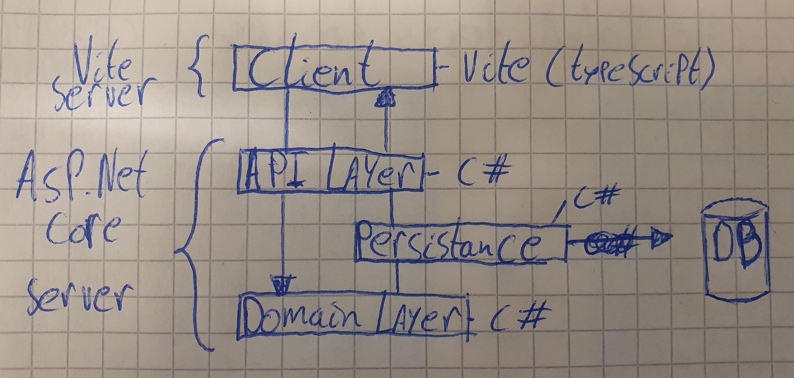

# Individueel project - Artesjokken

## Doel

Het doel van dit project is om een implementatie te maken van het kaartspelletje Artesjokken. Bij dit spel begint elke speler met 10 artesjok kaarten, 5 in de hand en 5 in diens persoonlijke trekstapel. Vervolgens zullen de spelers door het oogsten en spelen van verschillende groentenkaarten proberen om bij het pakken van een nieuwe hand, een hand te krijgen zonder Artesjokken. De speler die dat als eerste lukt heeft gewonnen.

## Software stack

De domein logica zal worden geschreven in C#, de Api server zal ASP.NET Core zijn en de client zal vite/vue zijn. 



## Technische Doelen

Het technische doel is om te leren werken met C# en ASP.NET Core.

## Persoonlijke doel

Mijn persoonlijke doel waar ik aan ga werken is om dingen niet tot het laatste moment uit te stellen, daarnaast doe ik een poging om te leren van de fouten van anderen, zoals werken met vertical slices.

## Back End
De back-end server kan gestart worden door in een terminal naar de /API folder te navigeren en daar de volgende command in te typen.
```bash
dotnet run
```

De back-end server luistert op http://localhost:5042/


## Front End
De Front-end server kan worden gestart door in een terminal naar de /Client folder te navigeren en daar de volgende commandos uit te voeren.
```bash
# Install the dependecies
npm install

# Start the server
npm run dev
```
De front-end server luistert op http://localhost:5173/
