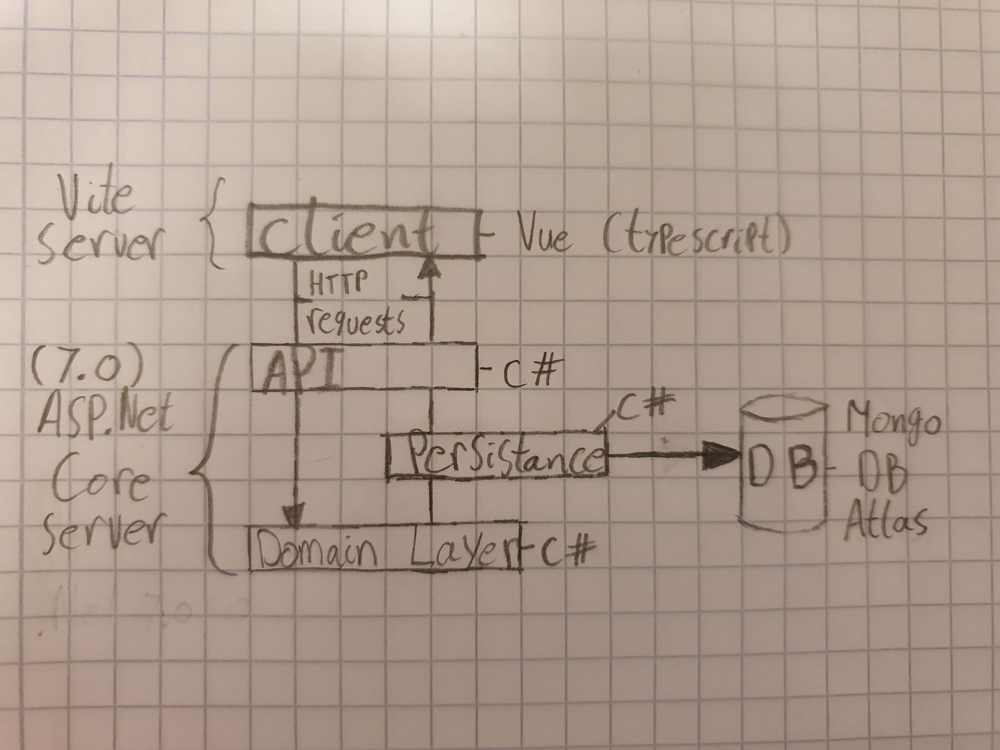

# Individual project - Artichokes

## Goal

The Goal of this project was to make a full-stack web application, as a way to conclude the acadamy part of my traineeship at Sogyo. 

I chose to implement a cardgame called Artichokes. With this game every player starts with 10 Artichoke cards, 5 in their hand and 5 in their personal drawpiles. Then each turn players will 'harvest' a card from the Gardensupply in the middle of the table and play as many cards from their hand as they want. They end their turn by putting the remaining cards from their hand on their personal discard pile and refilling their hand to 5 cards from their drawpile. The game ends if one player grabs a hand without any artichokes, that player than won.


## Software stack


De domain logic, and the API server were written in C# using ASP.Net Core. The Client server is vite/vue with typescript. In the persistance layer the gamestate is saved in a Mongo database.



## Technical Goals

My technical goal for this project was to learn to work with C#, ASP.Net Core, and vite/vue.

## Personal goal

My personal goal for this project was to avoid procrastinating my work till the last moment. I also tried to work with vertical slices have something in every layer as quickly as possible so i could then add features in every layer at once.


## Back End
De back-end server can be started by navigating to the /API folder in a terminal and running the following command.
(Dotnet version 7.0)

```bash
dotnet run
```

De back-end server listens on http://localhost:5042/


## Front End 
The Front-end server can be started by navigating to the /Client folder in a terminal and running the following command.
(Npm version 9.8.1)


```bash
# Install the dependecies
npm install

# Start the server
npm run dev
```
De front-end server listens on http://localhost:5173/


## Persistance
There are two possible repositories in the persistance layer to use, one that saves the gamestate in memory and one to save it in a Mongo database. To switch between the two repositories (for example because de mongo database is down), you can change which repository is injected by changing the addSingleton line in the API/Program.cs file.